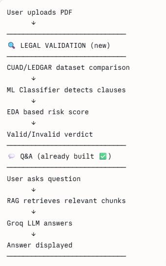

User asks question
      ↓
RAG Chain takes the question
      ↓
Sends question to FAISS → gets top 3 relevant chunks
      ↓
Those chunks become {context} in your prompt
      ↓
Question becomes {question} in your prompt
      ↓
Filled prompt sent to Groq LLM
      ↓
Answer returned to user ✅


{"context": retriever, "question": RunnablePassthrough()}
```
- `context` → retriever automatically fetches relevant chunks from FAISS
- `question` → `RunnablePassthrough()` just passes user question as is

**The `|` operator:**
Think of it like a **pipeline:**
```
Input question
    ↓
{"context": retriever, "question": question}  → fills prompt placeholders
    ↓
prompt                                         → filled prompt ready
    ↓
llm                                            → sent to Groq
    ↓
StrOutputParser()                              → converts to plain string
    ↓
Final answer ✅


**Visually:**
```
User asks: "What are the payment terms?"
            ↓
FAISS searches all chunks
            ↓
Returns top 3 most similar chunks:

Chunk 1 → "Payment shall be due within 30 days..."
Chunk 2 → "Late payments incur 2% penalty per month..."
Chunk 3 → "Invoice must be submitted before 5th..."
            ↓
These 3 chunks become {context} in your prompt


Step 1 — Retriever gets the question
         FAISS searches for top 3 similar chunks
            ↓
Step 2 — Chunks fill {context} in prompt
         Question fills {question} in prompt
            ↓
Step 3 — Filled prompt sent to Groq LLM
            ↓
Step 4 — StrOutputParser converts response to plain string
            ↓
Returns final answer as a string ✅


